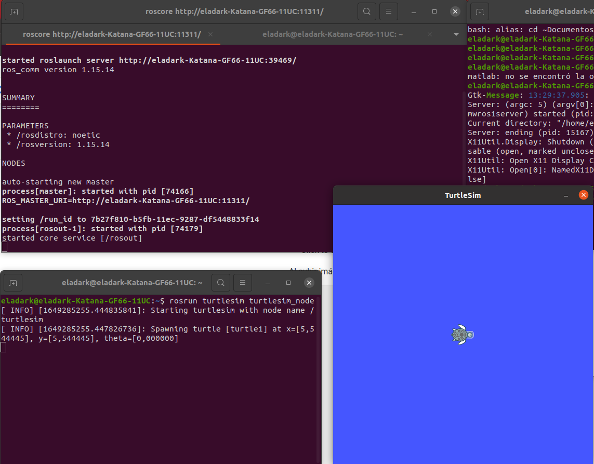
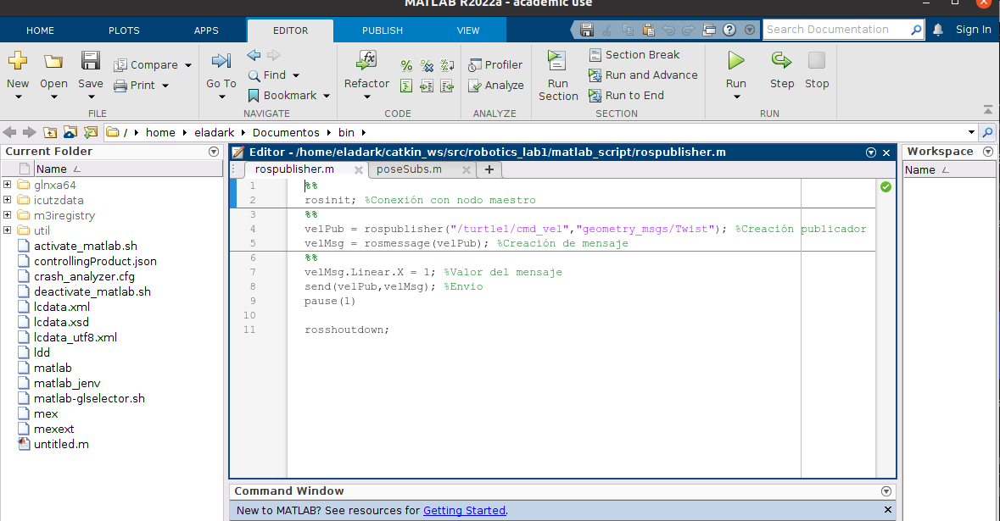
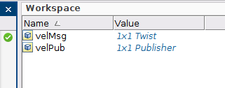
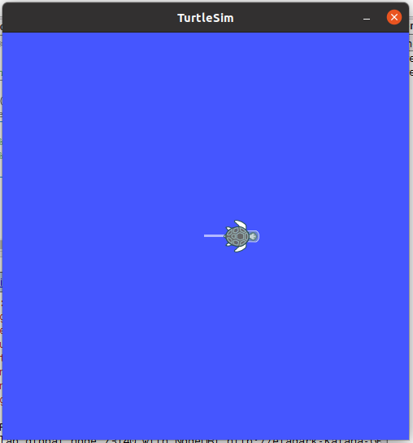
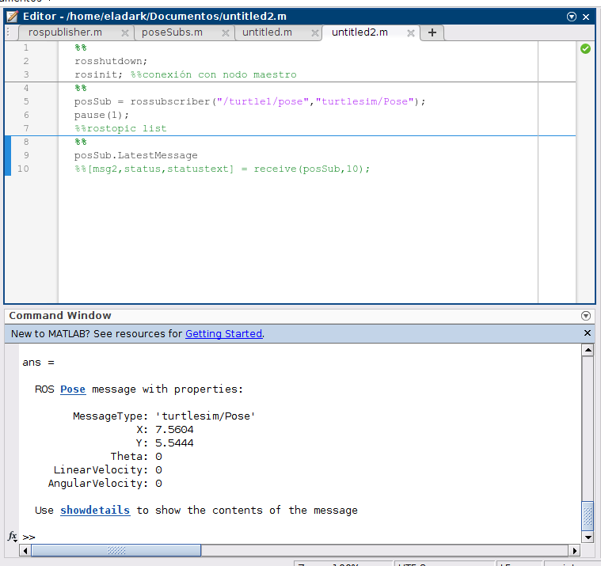
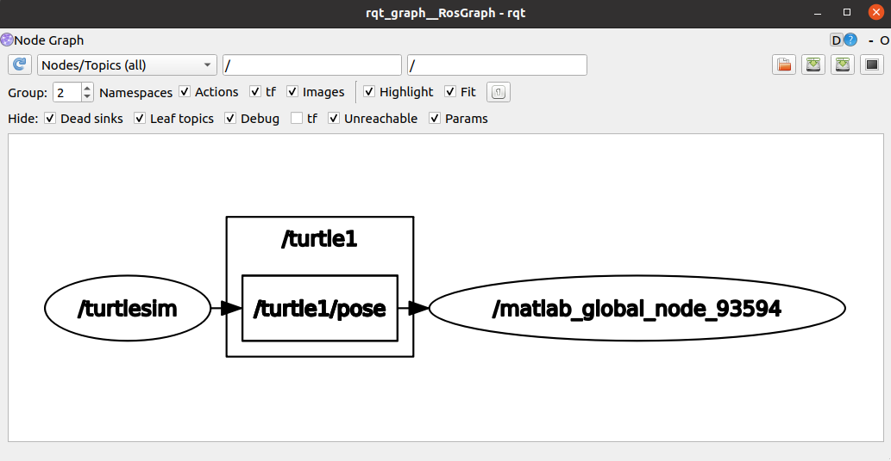
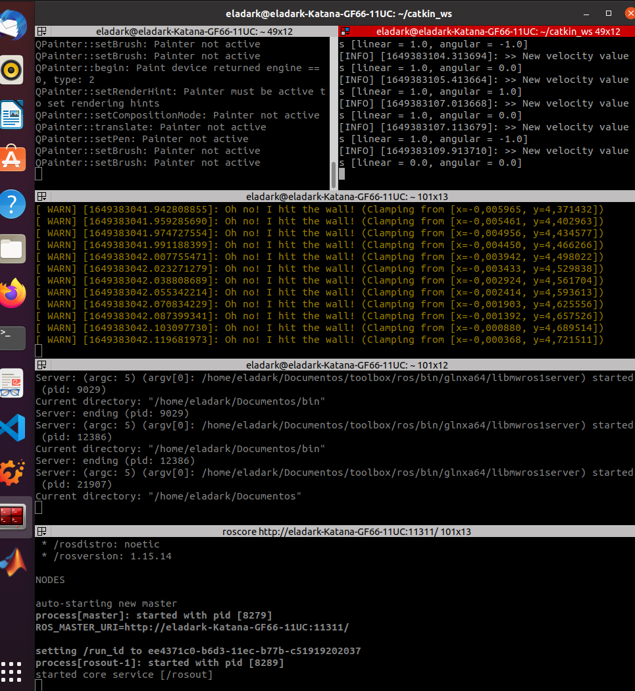
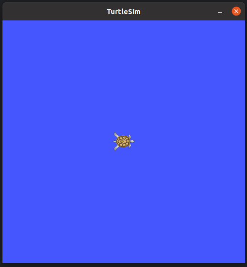
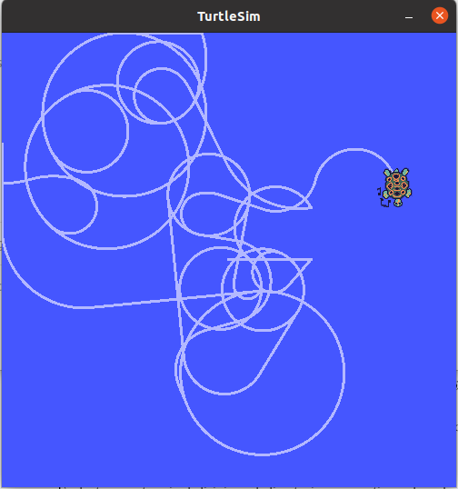
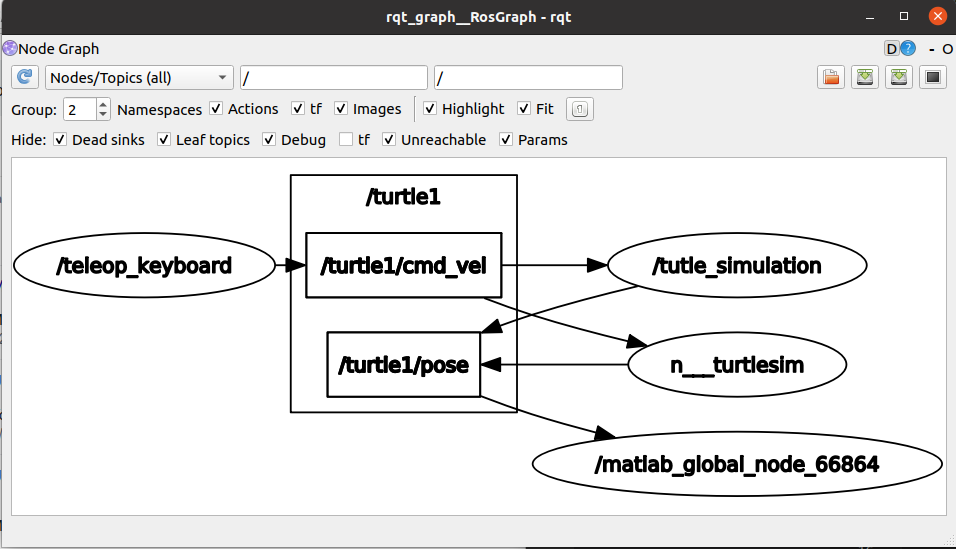

# robotics_lab1
Connection to ROS with matlab and teleop keys.

## Autores

- Camilo Andrés Borda
- Edwin Alfredo Higuera

## Procedimiento 
## Conexión Ros con Matlab

- Con Linux operando lanzar 2 terminales. En la primera terminal escribir el comando roscore
para iniciar el nodo maestro, en la segunda terminal escribir rosrun turtlesim turtlesim node, en este momento aparece la Tortuga tal y como se muestra en la siguiente imagen.



A continuación se procede a lanzar una instancia de Matlab y se creo el script poseSub.m.




Al correr la primera sección nos hemos conectado al modo maestro de ROS, lo cual queda evidenciado con el siguiente mensaje en command Window de Matlab.

```
The value of the ROS_MASTER_URI environment variable, http://localhost:11311, will be used to connect to the ROS master.
Initializing global node /matlab_global_node_73140 with NodeURI http://eladark-Katana-GF66-11UC:39157/ and MasterURI http://localhost:11311.
```
Tras correr la segunda sección se puede apreciar la creación del Publisher y el Message, de la siguiente manera. 



Para finalizar se ejecuta la tercera y ultima sección del script, la cual activa el nodo Publisher, el cual envia el mensaje de velocidad lineal en x = 1, al topico /turtle1/cmd_vel, generando el siguiente comportamiento en nuestra tortuga. 




- A continuación se crea un script en Matlab llamado poseSubs.m, que permite suscribirse al tópico de pose de la simulación de turtle1.



A modo de verificación se ejecuta el comando rqt_graph en la terminal, donde se obtiene el siguente grafico, el cual nos muestra como el nodo publica al topico /turtle1/pose, un tipo Pose, simultaneamente el nodo creado por matlab se suscribe al mismo topico para recibir el mensaje.



sin embargo, mas adelante se puede apreciar que el script poseSub.m es alterado buscando nuevas funcionalidades.

- Ahora se busca Crear un script en Matlab que permita enviar todos los valores asociados a la pose de turtle1.

- Consultando la manera en qué se finaliza el nodo maestro en Matlab se halló que esta acción se realiza mediante el comando:

```matlab
rosshutdown;
```
Esto es necesario por que matlab solo puede tener un nodo instanciado a la vez.

## Conexión Ros con Python

- En el paquete hello turtle de ROS, en la carpeta de scripts, crear un script de Python y escribir un código que permita operar una tortuga del paquete turtlesim con el teclado, que
cumpla con las siguientes especificaciones:

    -  Se debe mover hacia adelante y hacia atrás con las teclas W y S
    -  Debe girar en sentido horario y antihorario con las teclas D y A.
    -  Debe retornar a su posición y orientación centrales con la tecla R
    -  Debe dar un giro de 180° con la tecla ESPACIO

<br>

- Lanzar una terminal, dirigirse al directorio del workspace de catkin y escribir el comando
catkin make para hacer build en el paquete modificado.
- Con Linux operando lanzar 3 terminales. En la primera terminal escribir el comando roscore
para iniciar el nodo maestro.
- En la segunda terminal escribir rosrun turtlesim turtlesim node.
- En la tercera terminal dirigirse al directorio que contiene el workspace de catkin y escribir
source devel/setup.bash. Acto seguido escribir rosrun hello turtle turtle_TeleopKey.py. 




<br>
En este punto, la terminal ya deberı́a estar esperando el ingreso de teclas.
<br>



- Observar el movimiento de la tortuga con las teclas A, S, W y D, ası́ como los cambios en la
posición instantáneos con las teclas R y ESPACIO.






## Conclusiones:

- La principal ventaja de ROS se encuentra en permite una amplia integración entre diferentes sistemas y aplicaciones, lo que permite formar elaborados mecanismos roboticos con amplia variedad de ocupaciones. 

- Ros al ser un framework de codigo abierto se convierte de una gran comunidad de desarrolladores, que a tambien nutren el sistema con una gran variedad de librerias y repositorios no oficiales.

- Ros cuenta con una amplia documentación que permite desembolverse practicamente ante cualquier problema.